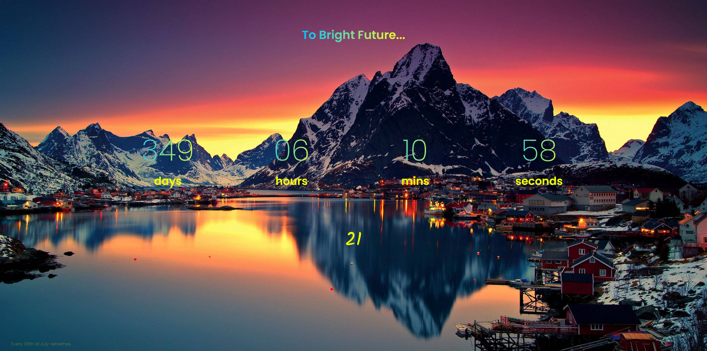

# Countdown Timer

# Overview
Made by:
- HTML
- Vanilla CSS
- Vanilla JS

### Fonts

- Poppins 200, 400, 600 for main content
- Kalam 400 for age

```css
<style>
@import url('https://fonts.googleapis.com/css2?family=Kalam&family=Poppins:wght@200;400;600&display=swap');
</style>
```
## Description 
Countdown for my birthday, 26th of July. My age increments annually also in page.
Change
```js
const bdate = "26 Jul "
let year = "2023"
let bday = bdate + year
let bdayDate = new Date(bday)
```
for another date.

```js
    if(totalSeconds < 1){
        year++
        bday = bdate+year
        bdayDate = new Date(bday)
        age.innerHTML = parseInt(age.innerHTML) + 1
    }
```
change it also for age increment.

### Author
- LinkedIn - [Ömer Fatih Bülbül](https://www.linkedin.com/in/ömer-fatih-bülbül-74a890236/)
- Twitter - [fatihbulbul91](https://twitter.com/fatihbulbul91)
